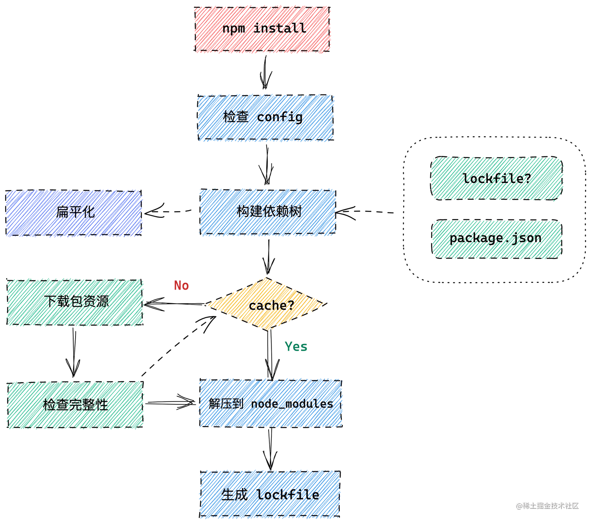

### 1. 理解 `npm、yarn` 依赖包管理的原理，两者的区别
两者都是包管理工具。

npm install 

yarn 与npm的差异：
1、有lockfile。npm在v5之后才出现package-lock.json文件
2、模块扁平化安装。将依赖包的不同版本，安装一定策略，归结为单个版本。(npm v3)
3、更好的网络性能。并发连接池，更好的利用网络资源。以及失败重试机制。
4、缓存策略。
5、yarn性能更优。

### 2. 可以使用 `npm` 运行自定义脚本

### 3. 理解 `Babel、ESLint、webpack` 等工具在项目中承担的作用

### 4. `ESLint` 规则检测原理，常用的 `ESLint` 配置

### 5. `Babel` 的核心原理，可以自己编写一个 `Babel` 插件

### 6. 可以配置一种前端代码兼容方案，如 `Polyfill`

### 7. `Webpack` 的编译原理、构建流程、热更新原理，`chunk`、`bundle` 和 `module` 的区别和应用

### 8. 可熟练配置已有的 `loaders` 和 `plugins` 解决问题，可以自己编写 `loaders` 和 `plugins`
